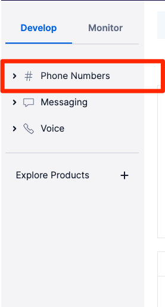
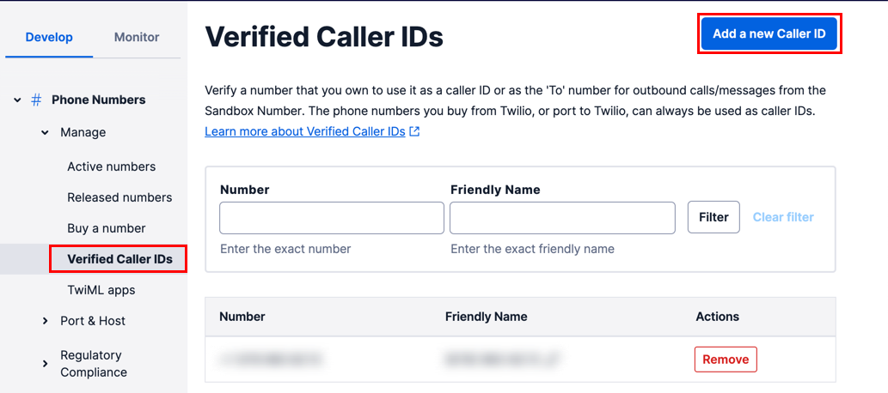
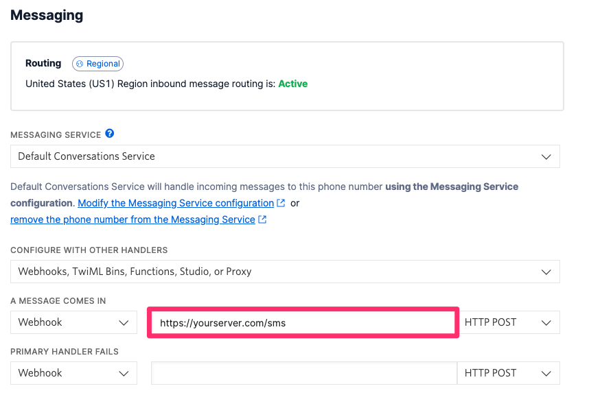
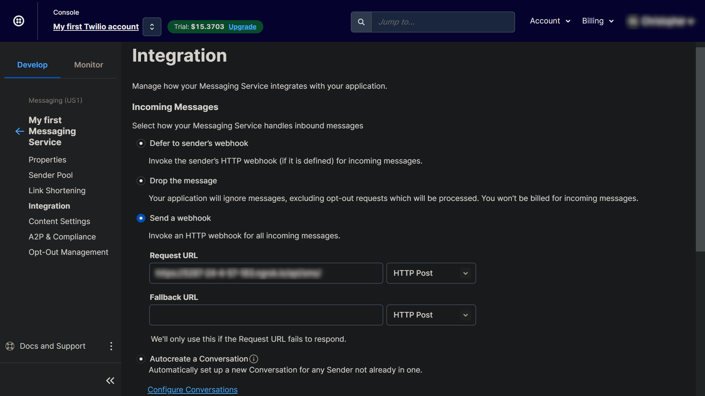
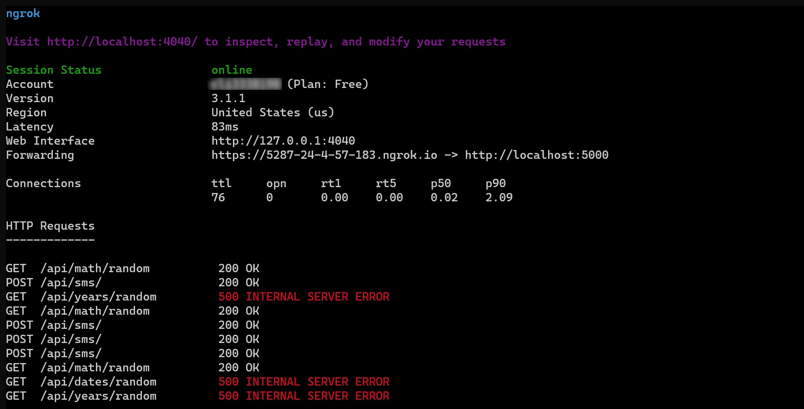
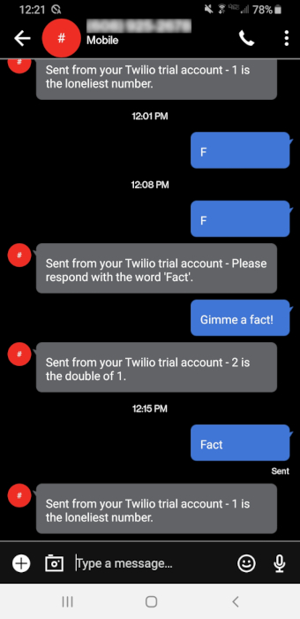

# Setting up Twilio's Programmable Messaging / SMS Webhooks

## Twilio Setup

- Sign up for Twilio

- Verify your personal phone number
  - When you sign up for a trial account, you can only send messages to non-Twilio numbers that have been verified

- Go to the dashboard and click Phone numbers

  

- Go to verified numbers and add the number

  

- Follow the steps and verify

- Go to buy a number and buy a number

## Python Setup

- Install Twilio CLI (linux example)

```
sudo apt install -y twilio
```

- Connect Twilio CLI to your account

```
twilio login
```

- Set up your python server (flask example)
  - This simple route returns a random fact from the database

```python
@sms.route('/', methods=["GET", "POST"])
def sms_reply():

  body = request.values.get('Body', None)
  # from the Twilio SDK, creates TwiML, markup that tells Twilio how to respond
  resp = MessagingResponse() 

  if not body or 'fact' not in body.lower():
    resp.message("Please respond with the word 'Fact'.")
    return str(resp)

  random_fact = get_random_fact()
  resp.message(random_fact)
  return str(resp)
```

- Install twilio SDK

```
pip install twilio
```
- Create a messaging service with your phone number

```
twilio api:messaging:v1:services:create --friendly-name "My first Messaging Service"
```
- Add your Twilio phone numbers to your messsaging service
  - Find `YOUR_SERVICE_SID` and `YOUR_PHONE_NUMBER_SID` in your dashboard

```
twilio api:messaging:v1:services:phone-numbers:create --service-sid <YOUR_SERVICE_SID> --phone-number-sid <YOUR_PHONE_NUMBER_SID>

```

## Adding your Python Webhook

### What is a Webhook?
<p>Webhooks are user-defined HTTP callbacks. They are usually triggered by some event, such as receiving an SMS message or an incoming phone call. When that event occurs, Twilio makes an HTTP request (usually a POST or a GET) to the URL configured for the webhook.<p>

- Log in to Twilio

- Go to <span style="text-decoration: underline">Phone Numbers<span>

- Click <span style="text-decoration: underline">Active Numbers<span>

- Click on the number that you want to connect your application to

- Scroll down to <span style="text-decoration: underline">Messaging<span>

- Click on <span style="text-decoration: underline">Modify the Messaging Service configuration</span>

  

- Select <span style="text-decoration: underline">Send a webhook<span>

  

- Enter the address of your deployed server or use Ngrok to run locally and make available on the internet

## Using Ngrok

### What is Ngrok?
<p>Ngrok is a cross-platform application that enables developers to expose a local development server to the Internet with minimal effort.<p>

- Login or register on <span style="text-decoration: underline">Ngrok.com<span>

- Download Ngrok

- Install (linux example)

```
sudo tar xvzf <YOUR_FILE_LOCATION>ngrok-v3-stable-linux-amd64.tgz -C /usr/local/bin
```

- Go to the dashboard and copy your <span style="text-decoration: underline">Authtoken<span>

- Authenticate your ngrok agent

```
ngrok config add-authtoken <YOUR_AUTH_TOKEN>
```

- Run your python application

- Copy the PORT where your server is running

- Start a tunnel

```
ngrok http <YOUR_PORT>
```

  

- Copy the randomly generated ngrok address indicated as <span style="text-decoration: underline">Forwarding<span>

- Enter the ngrok address into <span style="text-decoration: underline">Request URL<span>

  

## Result 🙌

  